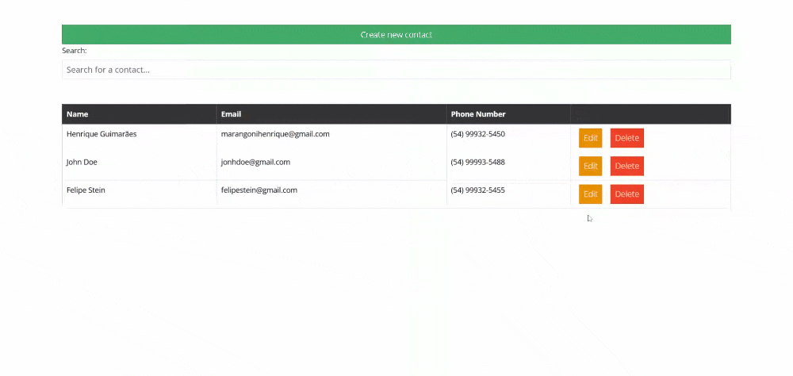

# Angular CRUD com API de Contatos

Este projeto é um aplicativo **Angular** que se conecta à **API de Contatos** para realizar operações de **cadastro**, **edição** e **pesquisa** de contatos.



## Versões

- **Node.js**: 14.x ou superior
- **Angular CLI**: 18.2.0
- **Backend (API)**: [CRUDAPI-Contact](https://github.com/HenriqueMG2/CRUDAPI-Contact) (API de Contatos)

## Requisitos

Antes de rodar o projeto, verifique se você tem os seguintes pré-requisitos instalados:

- **Node.js** (versão 14.x ou superior)
- **Angular CLI** (versão 18.2.0 ou superior)

### Instalar o Node.js

Caso não tenha o **Node.js** instalado, você pode baixá-lo [aqui](https://nodejs.org/).

### Instalar o Angular CLI

Se você ainda não tem o **Angular CLI** instalado, use o comando abaixo:

```bash
npm install -g @angular/cli
